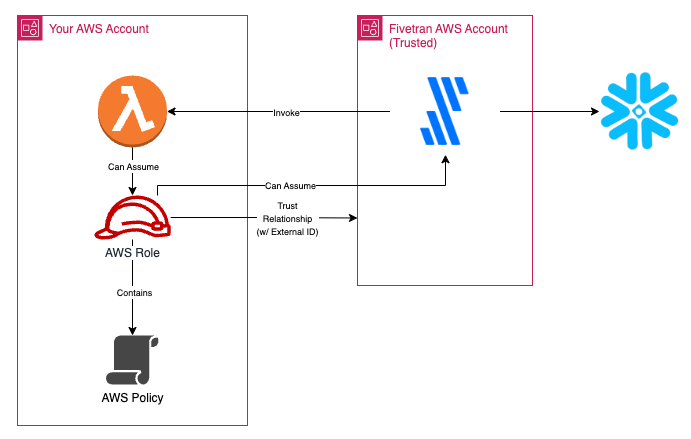

# Custom Source to Snowflake Pipeline Generator

## Overview



Data is being pulled from the Finnhub API for [stock candles](https://finnhub.io/docs/api/stock-candles) data

- Pulls it one day at a time up through the current date minus one week (because of when the data is updated in the Finnhub API)
- Will run every 24 hours and only pull net new data for that time period (unless a historical resync is triggered)

## Required Environment Prerequisites

- Must have an AWS account user and associated access key credentials with permissions to:
    - Create and modify lambda functions
    - Create and modify IAM roles and policies
    - Create S3 buckets
    - Write to a pre-defined terraform state S3 bucket (if remote terraform state is desired)
- Must have a Snowflake account with a Fivetran database and user granted appropriate permissions (see sample setup script):
- Must have a Fivetran account and an associated API key/secret pair

### Sample Snowflake Setup Script

```sql
create database if not exists FIVETRAN_DB;
create warehouse if not exists FIVETRAN_WH with warehouse_size='XSMALL';
create role FIVETRAN_ROLE;
create user FIVETRAN_USER password='%password%' default_warehouse=FIVETRAN_WH default_role=FIVETRAN_ROLE;
grant ALL PRIVILEGES on database FIVETRAN_DB to role FIVETRAN_ROLE;
grant USAGE on warehouse FIVETRAN_WH to role FIVETRAN_ROLE;
grant role FIVETRAN_ROLE to user FIVETRAN_USER;
```

## Usage


### Lambda Code
Update the code in the location [aws/lambda](./aws/lambda/). The code is used to query API data and pass it back to Fivetran.

### Infrastructure Naming
Update the values in [main.tf](./main.tf) if desired to change the names of the infrastructure that will be created
